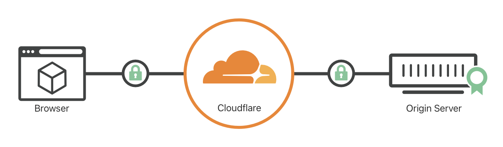

## Problem

The motivation is simply to add a layer of SSL/TLS to the server to add HTTPS functionalities. HTTPS is the current standard de facto and it is a necessary step to setup a reachable server.

## Available solutions

Usually we use something called a **TLS termination proxy** to setup the SSL/TLS.


A TLS termination proxy (or SSL termination proxy,[1] or SSL offloading[2]) is a proxy server that acts as an intermediary point between client and server applications, and is used to terminate and/or establish TLS (or DTLS) tunnels by decrypting and/or encrypting communications.
 

### Solution 1: Nginx + Certbot + Let’s Encrypt

Certbot can help manage the Nginx reverse proxy and handle renewal for the server. To enable `certbot` and `nginx` containers share resources, sharing volumes in the `docker-compose` may be a viable solution. The `certbot` can access to Let’s encrypt which is a facility for issuing short-termed SSL/TLS CA certificates free of charge.

### Solution 2: Traefik

I actually got to know [Traefik](https://traefik.io/) in the FastAPI documentations. It seems to be a modern alternative for Nginx which supports auto discovery and load balancing based on the architectures of the Docker Swarm or Kubernetes. It seems to use container tags to discover them. It also supports automatically renew the CA certificates, and has a beautiful control panel (although, impose security risks 🙁 )

Nevertheless one important drawback is that it is sort of an overkill for small personal servers, since its **high complexity** overweighs its benefit to automatic renewal which can be recognized by `certbot`.

### Solution 3: Cloudflare + Nginx

If you set up your DNS with Cloudflare, they have an option for you to proxy your request and Cloudflare will handle the secure communication between the client server and its proxy. Additionally, they also provide you with a max. 15-years origin CA certificate which is bound to your domain. You only need to bound your original server’s Nginx to the origin CA certificate and you are done. In my opinion it is the most suitable and fast setup for small servers.

## Implementation

- Obtain a domain of your own from a domain provider.
- Login into Cloudflare and enable the DNS for your domain.
    - Be sure to select “Proxied” in the mode.
- Select **SSL/TLS => Overview** to enable **Full (Strict)** mode.
- Select **SSL/TLS => Origin Server** to generate an **origin certificate**.
- Load the origin certificate to your nginx.

### Security augmentation

Although not enabled by default, you can add another layer of security by **Authenticated Origin Pull (mTLS)** which authenticates that the traffic is proxied from the cloudflare server, rather than directly accessed. This helps ensuring that the DDoS protection etc. from cloudflare is in effect.

Check the official document for details:

https://developers.cloudflare.com/ssl/origin-configuration/authenticated-origin-pull

That’s it! Your website now supports SSL/TLS.
