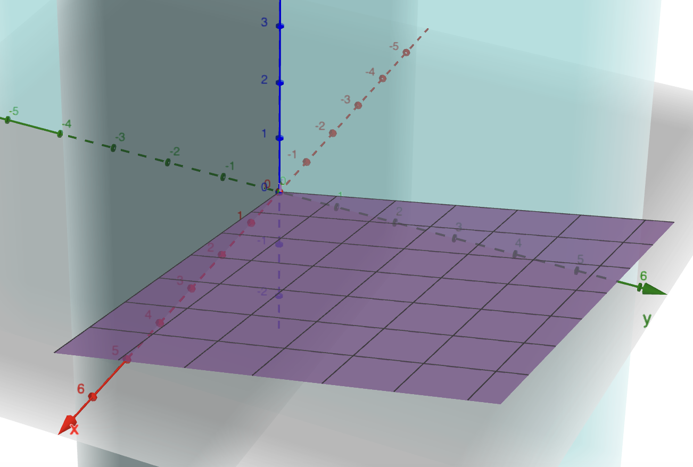

https://leetcode.cn/problems/er-wei-shu-zu-zhong-de-cha-zhao-lcof/description

## 碎碎念：关于算法博客 & Why LCR?

因为是第一篇也是第一篇Algorithm的blog，所以先说点啥（）

首先算法题主要是在leetcode cn上面刷的，所以主要使用中文来书写。这样可以直接摘录题目，防止中英文切换出戏（？

其次是关于这个博客的语言。我目前计划是用英文来进行书写，以适配最广大的受众。当然，你也会见到中文的post（比如说这篇）和日文的post。

再说回LCR。LCR原本是剑指offer系列，但是似乎力扣不再与剑指offer合作，所以将剑指offer换成了LCR开头，可以看这个[post](https://leetcode.cn/circle/discuss/jnfP42/view/3WxWlc/)。

目前的小目标是把LCR过一遍，并把对我有一定思考量，日后可以参考的题目记录在这里。

题解会使用Python，因为~~人生苦短我用Python~~。

## 题目

`m`*`n` 的二维数组 `plants` 记录了园林景观的植物排布情况，具有以下特性：

- 每行中，每棵植物的右侧相邻植物不矮于该植物；
- 每列中，每棵植物的下侧相邻植物不矮于该植物。

请判断 `plants` 中是否存在目标高度值 `target`。

**示例 1：**

```
输入：plants = [[2,3,6,8],[4,5,8,9],[5,9,10,12]], target = 8

输出：true

```

**示例 2：**

```
输入：plants = [[1,3,5],[2,5,7]], target = 4

输出：false

```

**提示：**

- `0 <= n <= 1000`
- `0 <= m <= 1000`

## 思考

看到这个描述会自然地想到一个“地形”一样的东西。如果用z轴的数值分布的话，它大概长这样 – 从左到右递增，从上至下递增。



> **关于一点Geogebra** 
> 限制定义域：`f(x,y) = 0.2x + 0.2y, (y >= 0)`，格式比较奇妙。

那么我们会不由自主地想到从左下角到右下角的那个“山脊”。这个山脊具有非常特殊的属性。我们暂时把它上面的这些数称为`pivot`。

如果在山脊处取一个数`pivot`，发现目标数`target`大于它，那么一定是往其右侧寻找。其原因是`target`是肯定大于这个数以及它所在这个列的所有的数的。这样，相当于每走一步，便排除了一列。

如果发现`target < pivot`呢？思考其搜索域，即`pivot`所在列的以左所有列都可以排除，`pivot`所在列及`pivot`所在列的右侧列均是搜索的范围。在此之上，我们同样可以排除该行，因为我们知道`target<pivot<[pivot以右的pivot]`。

所以我们的下一步便是向上走一步。我们非常惊喜地发现，之后的过程事实上是将这个压缩的过程在更小的搜索空间上实施。这样，我们能保证一定能搜索到`target`，或者这个算法是一定能退出的。


红色的是被我们排除的空间，绿色是这次迭代完成之后的新搜索空间。

考虑到我们走的步数，我们的这个算法是线性，`O(m+n)`的。

## 代码实现尝试

我们的思路具有一定的递归性质，但是我们并不需要使用递归函数。我们更多的是实现一个“走格子”的行动。

首先我们先决定退出条件。显然，这个退出条件是越界。

随后我们实现如上所述的算法。

```python
class Solution:    
    def findTargetIn2DPlants(self, plants: List[List[int]], target: int) -> bool:
        # TODO: Boundary exit case        
        if len(plants) == 0 or len(plants[0]) == 0:            
            return False        
        m, n = len(plants), len(plants[0])
        # Set pointer to lower left        
        row, col = m - 1, 0        
        while row >= 0 and col < n:
            # While not overbound            
            pivot = plants[row][col]            
            if target == pivot:                
                return True            
            elif target > pivot:
                # Move to the right                
                col += 1            
            else:
                # Move to the upper side                
                row -= 1        
                return False
```

AC，速度99%+。

## 看题解

我想到的这个方法居然叫作Z字形查法（？）

此外，官方题解给出了一个`O(mlogn)`的方法。方法是逐行进行二分查找。
```python
class Solution:    
    def searchMatrix(self, matrix: List[List[int]], target: int) -> bool:        
        for row in matrix:            
            idx = bisect.bisect_left(row, target)            
            if idx < len(row) and row[idx] == target:                
                return True        
            return False

作者：力扣官方题解链接：https://leetcode.cn/problems/search-a-2d-matrix-ii/solutions/1062538/sou-suo-er-wei-ju-zhen-ii-by-leetcode-so-9hcx/
来源：力扣（LeetCode）著作权归作者所有。
商业转载请联系作者获得授权，非商业转载请注明出处。
```

这种方法个人感觉比较适合这个矩阵是非常skew，一边长一边短的。这样，在长边上做二分会比较快速。

## 复习Python的二分库

官方题解提到了Python的二分库，所以复习一下。以下内容摘自Python官方文档。

> `bisect.bisect_left(a, x, lo=0, hi=len(a))`
> 
> 
> 在 *a* 中找到 *x* 合适的插入点以维持有序。参数 *lo* 和 *hi* 可以被用于确定需要考虑的子集；默认情况下整个列表都会被使用。如果 *x* 已经在 *a* 里存在，那么插入点会在已存在元素之前（也就是左边）。如果 *a* 是列表（list）的话，返回值是可以被放在 `list.insert()` 的第一个参数的。
> 
> 返回的插入点 *i* 可以将数组 *a* 分成两部分。左侧是 `all(val < x for val in a[lo:i])` ，右侧是 `all(val >= x for val in a[i:hi])` 。
> 
> =====分割线=====
> 
> `bisect.bisect_right(a, x, lo=0, hi=len(a))`
> 
> 类似于 [`bisect_left()`](https://docs.python.org/zh-cn/3.6/library/bisect.html#bisect.bisect_left)，但是返回的插入点是 *a* 中已存在元素 *x* 的右侧。
> 
> 返回的插入点 *i* 可以将数组 *a* 分成两部分。左侧是 `all(val <= x for val in a[lo:i])`，右侧是 `all(val > x for val in a[i:hi])`。
> 

说的更清楚一点就是，`bisect`的算法采用了了[Dijkstra推荐的左闭右开的原则](https://www.cs.utexas.edu/~EWD/transcriptions/EWD08xx/EWD831.html)。一个数组可以被分解为`< pivot`， `= pivot`，`> pivot`的部分（联想荷兰国旗问题）。

- `bisect_left`返回了一个值`i`使得 [lo, i) 代表小于pivot的区间，而 [i, hi) 代表大于等于pivot的区间。
- `bisect_right`返回了一个值`i`使得 [lo, i) 代表小于等于pivot的区间，而 [i, hi) 代表大于pivot的区间。

所以事实上`[bisect_left:bisect_right]`返回的就是`=pivot`的区间，因为其满足其值`>= pivot`且其值`<= pivot`。

> **Note**
>
> 当然，使用的时候记得考虑**越界**的问题，比如说：数组所有的数都大于/小于pivot的时候。