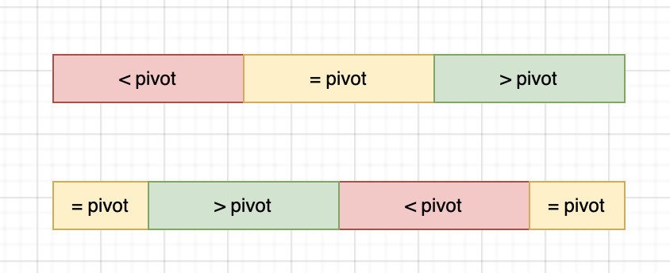
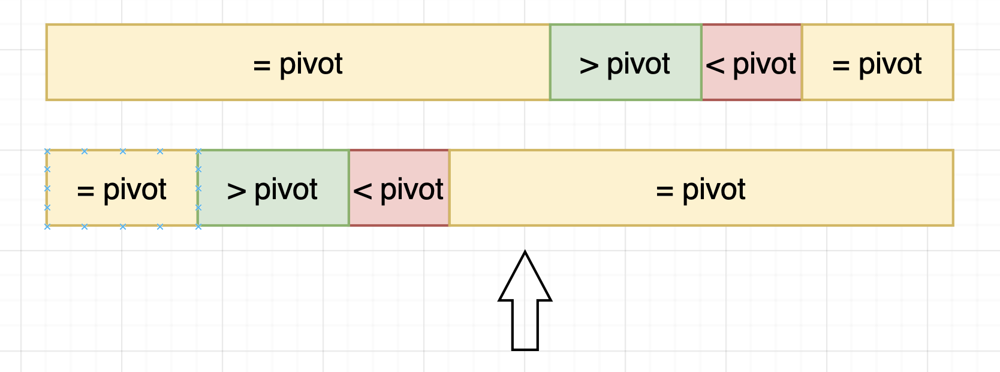

首先这并不是一篇关于二分查找的算法解析，更多的是一篇碎碎念。事实上已经有超级多比我厉害的大佬写过关于二分查找的教程了。

本篇碎碎念的思考来源来自于这里：

[知乎-David Hobbes-聊聊一看就会一写就跪的二分查找](https://zhuanlan.zhihu.com/p/343138037)

如果你对我这篇博文一头雾水可以先看看这篇文章。

## 关于二分的适用范围

上面那篇文章给出了我觉得非常精妙的精准定义：

> 1. **映射**：存在一个映射$f$，映射$x$的值为一个布尔值，表示$x$是否满足某种性质。
> 2. **单调**：设false < true，对于所有的$x，y$，如果$x < y$，则$f(x) \leq f(y)$。
> - 非常重要！这个性质可以让二分查找同样适用于单调递减的序列。
> 3. **指针不变性**：划定一个待查找区间`[l, r)`，其满足：$f(l-1)$为false，$f(r)$为true。
> 4. **目标**：找到最小的$x$，使得$f(x)$为true。

只有满足这样的问题你才可以使用公式化的二分：

```py
def bisect(arr, l, r, condition):
    while l < r:
        mid = l + (r - l) // 2
        if condition(mid):
            r = mid
        else:
            l = mid + 1
    return l
```

作者也给出了一个正确性的证明。有兴趣的可以去看看。

## 旋转数组的最小值

为什么会谈论起这个问题呢，是因为当时一直想用上面的那个二分模版来解决这个问题。

当时忙活了好一阵子，最后得出的结论是好像这个问题并不能用这个体系来套用。

我们来分析一下这个问题吧。先将问题摘录在这里：

> 有一个长度为 n 的非降序数组，比如[1,2,3,4,5]，将它进行旋转，即把一个数组最开始的若干个元素搬到数组的末尾，变成一个旋转数组，比如变成了[3,4,5,1,2]，或者[4,5,1,2,3]这样的。请问，给定这样一个旋转数组，求数组中的最小值。

我们要寻找的是第一个满足条件的元素。如果各个元素都不相同，那其实这也是符合上面的套路的条件的。

具体而言我们的condition是：
- 选定数组的第一个元素作为pivot。
- 我们需要找到的是第一个小于pivot的元素。
- 这样，整个数组可以被映射至一个布尔条件，并且其符合单调性。（左边大于等于pivot，右边小于pivot）

遗憾的是，这个数组是非降序的。我们来画一张图来表示这个数组的情况。特别的，我们将原来没有rotate过的数组的三个部分拿出来，它们是：`>pivot`, `<pivot`, `=pivot`。



旋转过后，这个数组便不再遵从单调性了。

## 进一步思考
那么是不是说明说这种通用思路完全无法使用呢？

不一定。请允许我引用原作者对于这个问题的正确性证明（数学归纳法）：
>1. 当d = r - l = 0时，代码不会进入for循环，直接返回l。由问题严格陈述的第3点我们知道f(l - 1) = false和f(r) = true，又因为此时l = r，所以直接返回l就是正确的答案。
>
>2. 假设对于所有的d = 0, 1, 2, ..., k - 1，该算法都能返回正确的答案l。那么当d = k时，代码将会进入for循环，此时中点m ∈ [l, r)。这时候分两种情况：
>
> - 如果f(m) = false，我们令l = m + 1，此时依然满足问题严格陈述的第3点(划定一个待查找区间`[l, r)`，其满足：$f(l-1)$为false，$f(r)$为true)，但是区间长度d变小了。
>
> - 如果f(m) = true，我们令r = m，此时同样满足问题严格陈述的第3点(划定一个待查找区间`[l, r)`，其满足：$f(l-1)$为false，$f(r)$为true)，但是区间长度d也变小了。

仔细观察可以意识到，如果`mid`落在`>pivot`或者`<pivot`的区间内，那么并不影响该证明的正确性。该算法所划出的查找区间，仍然包含了最小值的分界点。

关键在于，当`mid`落在`=pivot`的区间内时事情就变得拧巴了。


这种情况其实还是完全没有问题的，因为我们的condition是`<pivot`, 仍然符合单调性。



这种情况就不太行了。此时，由于`mid=pivot`不符合条件，我们应当将搜索范围缩小至右边。不幸的是，在第二种情况中右边并没有我们的答案。

观察这种情况，我们发现它的表达方式是`nums[left] == nums[right] == nums[mid]`。这种情况下，我们无法判断最小值在哪一边。

事实上官方的答案是在这种情况下逐渐缩减右边界by 1。其实这样从图上也好理解，把右边的等于部分压没了之后，就会退化成图1的状态。

但是这样的算法是O(n)的。既然这样，不如在这个区间内直接暴力搜索。（这也是剑指offer的解法XD）

以下是我的代码：

```py
class Solution:
    def minNumberInRotateArray(self , nums: List[int]) -> int | None:
        if not nums:
            return None
        # The array is not rotated at all
        if nums[0] < nums[-1]:
            return nums[0]
        pivot = nums[0]
        l, r = 0, len(nums) - 1
        while (l < r):
            mid = l + (r - l) // 2
            if (nums[l] == nums[r] and nums[l] == nums[mid]):
                return self.sequentialSearch(nums, l, r)
            if (nums[mid] < pivot):
                r = mid
            else:
                l = mid + 1
        return nums[l]
    
    def sequentialSearch(self, nums, l, r):
        return min(nums[l: r+1])
```