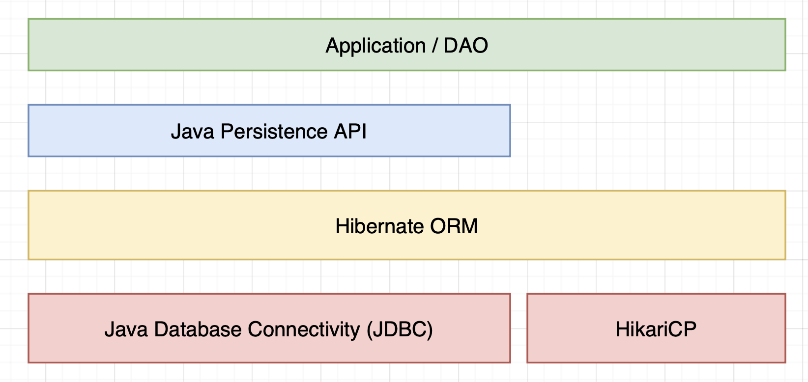

今天看了一下java语言是如何访问数据库的，结果被内容和rather verbose的语法冲的头昏脑胀（？）

记录一下我自己对于java数据层结构的一些理解（希望以后不要被自己错误的理解打脸x）

（以及，我会感觉很多语言的数据层结构的philosophy是一样的，所以这个也有助于用来理解其他语言的数据层结构）



## 最底层：JDBC和HikariCP连接池

**JDBC是java访问数据库的标准接口**。JDBC提供了一套访问数据库的API，可以通过JDBC来访问数据库，执行SQL语句，获取查询结果等。

它的实现是通过JDBC**驱动程序**来实现的，不同的数据库有不同的驱动程序。

连接是一个昂贵的资源，所以我们需要有效率地复用连接。**连接池**解决了这个问题，当需要连接的时候，从连接池中获取连接，使用完毕后，将连接放回连接池。HikariCP是目前常用的一个高性能的连接池。

## Hibernate和JPA

聊Hibernate之前得先聊聊JPA。

**JPA规范定义了java的对象关系映射（ORM）的标准，将对象映射至数据库的表**。它使用Entity Manager来向数据库中CRUD对象，而不需要亲自编写JDBC或者SQL语句。它也提供了查询语言。

（当然它也定义了不少其他的东西）

Hibernate是一个ORM框架，不仅实现了JPA规范，还提供了一些其他的功能。Hibernate可以通过注解来定义实体类和数据库表之间的映射关系。

## DAO

DAO（Data Access Object）是一个数据访问对象，用于访问数据库。它提供了一些方法，用于CRUD数据库中的数据。

举一个简单的例子

```java
public interface UserDao {
    User getUserById(int id);
    void insertUser(User user);
    void updateUser(User user);
    void deleteUser(int id);
}
```

这样用户就不用关心数据库的操作，只需要调用DAO的方法即可，有利于解耦。但是事实上在不少的情况下，service直接操作数据库也是可以的。

## Spring的事务管理(Transaction Management)

虽然有点离题，但是spring通过实现一些Transaction Manager来实现事务管理，这样可以保证一组操作要么全部成功，要么全部失败（如果不熟悉事务，可以去看看ACID）。Spring在事务扔出RuntimeException的时候会自动回滚。

> 所以通常我们建议在处理事务时派生RuntimeException，这样就不用再去手动处理了。

举个栗子：

```java
@Transactional
public void transfer(int from, int to, int amount) {
    User user1 = userDao.getUserById(from);
    User user2 = userDao.getUserById(to);
    user1.setBalance(user1.getBalance() - amount);
    user2.setBalance(user2.getBalance() + amount);
    userDao.updateUser(user1);
    userDao.updateUser(user2);
}
```

另外注意，在Spring中事务默认是具有**传递性**的。

也就是说在一个transactional的方法中调用另一个transactional的方法，那么这两个transaction会被合并成一个transaction来执行并共同commit或者rollback。

或者，引用一下[廖雪峰老师](https://liaoxuefeng.com/books/java/spring/database/declarative-tx/index.html)的精确说明：

> "Spring的声明式事务为事务传播定义了几个级别，默认传播级别就是REQUIRED，它的意思是，如果当前没有事务，就创建一个新事务，如果当前有事务，就加入到当前事务中执行。"