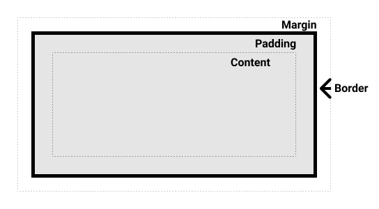

学习 tailwind 之后想学习一下 CSS 的基础概念，所以去翻了 [mdn CSS 基础](https://developer.mozilla.org/zh-CN/docs/Learn_web_development/Core/Styling_basics)。

有一些选择器感觉是非常适合原来的 vanilla CSS 而设计出来的，
但是对于 tailwind 这种 utility-based 的 CSS framework 不太常用
（一个例子是`+`这种兄弟 selector）。

所以记录一下比较核心的概念（相对经常用到的）。
这篇文章主要写**选择器**和**盒子模型**。

## 1. 选择器

选择器选定 HTML DOM Tree 中的既定元素，并且增加对应的样式。

以下是一些很常用的选择器样式的格式。

```css
/* 选择一种html tag类型 */
h1 {
}

/* 选择一个类 */
.class1 {
}

/* 选择一个id */
#id1 {
}

/* 有title属性的锚元素（anchor）*/
a[title] {
}

/* 有href, 并且href是"https://example.com"的元素 */
a[href="https://example.com"]
{
}

/* *****复合选择器***** */
/* 选择一个既有class1又有class2的h1 element */
h1.class1.class2 {
}

/* 后代选择器：选择为div的子元素的p (后代) */
div p {
}

/* *****伪类与伪元素***** */
/* 伪类 用:标记 */
a:hover {
}

/* 伪元素 用::标记 */
a::after {
  /* 必须设置content属性，即使是空字符串。 */
  content: "";
}
```

## 2. 伪类和伪元素

这个对我是一个比较新的概念。

伪类指的是在特定状态下才被 apply 的选择器。比如说：hover 的时候。

伪元素创造一个*虚拟元素*。它可以被视为目标元素的子元素。
例如说，可以用`::before`或者`::after`在元素前后添加新内容。
也可以精准选定第一行等等。

除了在元素前添加图标之外，
由于可以被视为目标的子元素，因此理论上也可以对目标元素使用`relative`，
然后子元素使用`absolute`来添加覆盖该元素的阴影或者动画效果。

这里有一个类似 Material design 的水波纹效果的例子。

```css
button {
  position: relative; /* 让 ::after 绝对定位时相对这个按钮 */
  overflow: hidden; /* 防止水波超出按钮 */
  background: #3498db;
  color: white;
  border: none;
  padding: 12px 24px;
  cursor: pointer;
  font-size: 16px;
}

button::after {
  content: "";
  position: absolute;
  top: 50%;
  left: 50%;
  width: 200%;
  height: 200%;
  background: rgba(255, 255, 255, 0.3);
  transform: translate(-50%, -50%) scale(0);
  border-radius: 50%;
  transition: transform 0.4s ease-out, opacity 0.4s ease-out;
}

button:active::after {
  transform: translate(-50%, -50%) scale(1);
  opacity: 0;
}
```

感觉不少 css 特效的底层都用到了伪元素，算是解答了心中的一个疑惑。

## 3. 盒模型

> 我超！盒！

盒模型是 CSS 的基础之一，包含`content`, `padding`, `border`, `margin`。



盒子的参数可以被归纳为：外部显示类型和内部显示类型。

### 3.1 外部显示类型(outer display types)

1. `block`

   - 产生换行。
   - 高宽设置(`width`, `height`)有效。
   - padding, border, margin 会将其他元素推开。
   - 未指定宽度时，通常直接占到 100%父容器的宽度。

2. `inline`

   - 不产生换行。
   - 高宽设置无效。
   - padding, border, margin 会被应用。水平的边距会把其他元素推开。但是，垂直边距不会把其他`inline`元素推开。也就是说，_如果溢出的话，会和其他`inline`元素重叠_。

3. `inline-block`

   - 是`inline`和`block`的 mix。
   - 不产生换行。
   - 高宽设置(`width`, `height`)有效。
   - padding, border, margin 会将其他元素推开。

### 3.2 内部显示类型(inner display types)

通常指的是`flex`, `grid`这种掌管内部元素排布的类型。

### 3.3 替代盒模型

Tailwind 默认使用的是替代盒模型。(事实上，替代盒模型也是现代 css 开发的最佳实践。)

```css
.box {
  box-sizing: border-box;
}
```

原有的盒模型，`width`和`height`指的是盒子的内容大小，也就是实际大小应该加上`padding`和`border`。

替代盒模型中，`width`和`height`指的是盒子可见范围的大小，也就是算进了`padding`和`border`的大小。


### 3.4 细节：外边距折叠 Margin Collapsing

算是一个细节，这里引用原文。

> 外边距是盒子周围一圈看不到的空间。它会把其他元素退推离盒子。
>
> 外边距属性值**可以为正也可以为负**。在盒子一侧设置负值会导致盒子和页面上的其他内容重叠。

但是，当两个外边距重合的时候，有一套独特的计算方法。

简而言之就是“合并 取最大”。

> 根据外边距相接触的两个元素是正边距还是负边距，结果会有所不同：
>
> 两个正外边距将合并为一个外边距。其大小等于最大的单个外边距。
>
> 两个负外边距会折叠，并使用最小（离零最远）的值。
>
> 如果其中一个外边距为负值，其值将从总值中减去。

---

以上。
