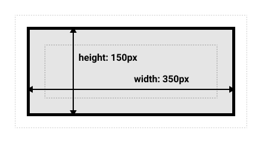

这篇文章提供一个个人的快速索引，
旨在以后忘记 html,css,js 时能尽快恢复大部分的核心知识。

这篇文章的要求的知识范畴是：知道这些东西能让你更有自信地使用框架（例如 React）。

详细的语法大部分不会包括在内，大部分时候你可以直接查询。

> **这不是一篇教学笔记。**

## HTML

HTML 是一种 markup language，渲染时形成 DOM Tree.

HTML 提供**块级元素**和**内联元素**（虽然新标准提供更加详细而复杂的分类，但是可以这么来表现）。

HTML 可以展示文字，图片，视频，音频，画布，以及超链接。

HTML 可以表现不同的标题，强调，斜体，horizontal line，上下标。

HTML 的 tag 一些具有语义。
对于一个页面其结构一般是`header`, `nav`, `main`, `aside` （侧边栏）, `footer`.
对于部分一般使用`section`。

只有在没有适合语义的时候（例如对一组元素做 styling 时）才使用无语义的块级元素`<div>`
和内联元素`<span>`。此外，`<h1>`一般一个页面只用一次，方便 SEO。

HTML 的 header 可以设置 title 标题，charset, favicon，description 描述，lang 语言等元信息。
这些对于 SEO 非常重要。

[元素参考](https://developer.mozilla.org/zh-CN/docs/Learn_web_development/Core/Structuring_content/Basic_HTML_syntax)

[Header 相关的设置](https://developer.mozilla.org/zh-CN/docs/Learn_web_development/Core/Structuring_content/Webpage_metadata)

---

## CSS

### 层叠

CSS 层叠样式表的核心是**层叠**。

层叠体现在：顺序（后来的会覆盖前面的），优先级（一套优先级计算机制），继承（一些属性，例如颜色，会被子元素继承）。

[层叠规则](https://developer.mozilla.org/zh-CN/docs/Learn_web_development/Core/Styling_basics/Handling_conflicts)

### 选择器

CSS 通过选择器来进行元素的选定。你可以用 id，class，或者 type (html tag 的类型) 来选定。

CSS 也可以选择后代或者多个条件同时满足的元素。

[选择器语法](https://developer.mozilla.org/zh-CN/docs/Learn_web_development/Core/Styling_basics/Basic_selectors)

### 伪类与伪元素

伪类可以选择一个元素在特定的状态下的样式，例如 hover。用单个冒号，形如`:hover`。

伪元素可以选择一个元素并且为其添加一个虚拟元素，这个虚拟元素如同其**子元素**，
所以你可以通过`relative`, `absolute`来 style 它。用双冒号，形如`::after`。

[伪类和伪元素](https://developer.mozilla.org/zh-CN/docs/Learn_web_development/Core/Styling_basics/Pseudo_classes_and_elements)

### 盒模型

在 CSS 中，一切都是盒。

[盒模型](https://developer.mozilla.org/zh-CN/docs/Learn_web_development/Core/Styling_basics/Box_model)

两个注意点：

- 用【替代盒模型】是现代最佳实践，其 width 和 height 描述的是 content + padding + border
- Margin 可以为负并且产生 merge。



盒有三种外部表现：`block`, `inline`, `inline-block`。（块级/内联）

最大的区别就是：是否**换行**，**width/height** 设置是否有效，是否把周围元素**推开**。

内部表现包含`flex`和`grid`。

`flex`是弹性盒模型。它可以让元素在一维上对齐，并且可以让元素按照自己的内容伸缩（`flex-1`, etc.）

`display`属性定义了内部和外部的表现。

[display](https://developer.mozilla.org/zh-CN/docs/Web/CSS/display)

[弹性盒模型 flexbox](https://developer.mozilla.org/zh-CN/docs/Learn_web_development/Core/CSS_layout/Flexbox)

### 字体样式与字体栈

在 `font-family` 中堆叠一系列字体，最后一个字体为系统默认字体的标识，以确保字体可用。
这被称为字体栈。

```css
p {
  font-family: "Trebuchet MS", Verdana, sans-serif;
}
```

保底字体为：`serif`（衬线），`sans-serif`（无衬线），`monospace`（等宽，一般用于代码）

[字体](https://developer.mozilla.org/zh-CN/docs/Learn_web_development/Core/Text_styling/Fundamentals)

### 布局流与定位技术

默认地，文档将按照默认布局流进行排布。

CSS 利用`position`将元素移出默认布局流，并且用`inset`等来定位他们。以下改写自 mdn。

- 静态定位（`static`）：放在默认位置。
- 相对定位 (`relative`): 相对于原来其【应该在的默认位置】进行移动。
- 绝对定位 (`absolute`): 相对于其最近被定位祖先元素（比如被设置为`relative`的）。
  **如果祖先树不存在这样的元素，那么相对于`<html>`进行调整。**
  （所以你需要指定一个祖先元素为`relative`然后才能正常使用`absolute`）
- 固定定位（`fixed`）: 相对于视窗。
- 粘性定位（`sticky`）: 先保持和 `static` 一样的定位，当它的相对视口位置（offset from the viewport）达到某一个预设值时，它就会像 position: fixed 一样定位。

[布局流](https://developer.mozilla.org/zh-CN/docs/Learn_web_development/Core/CSS_layout/Introduction)

## Javascript

此处不涉及 js 基本语法，异步编程 etc.，只涉及浏览器中重要的模式和知识。

### 事件与事件冒泡

DOM node 可以触发事件，可以登记 callback 以响应事件。

在一个 dom node 触发的事件会默认冒泡至其父节点。

callback 中的`event` (`(e) => {...}`)中包含了一些重要信息。

- `e.target`：触发了这个事件的元素。
- `e.currentTarget`：处理这个事件的元素（这个 callback 被 register 的元素。
  例如说，冒泡的时候，target 就会是这个子元素，`currentTarget`就是目前事件到达的父元素）。
- `e.preventDefault()`： 禁止默认行为（例如表单中按钮的默认行为是提交表单）

### Web APIs

提供一些重要的 Web API。

客户端重要的 objects:

- `Window`：可以得到窗口大小等信息。
- `Navigator`：媒体流等信息。
- `Document`：操作 DOM（增加 node 等等）

客户端存储 objects：

- `sessionStorage`: 浏览器关闭时会消除的 kv pairs。
- `localStorage`：会持续保存，浏览器重启也不会消除的 kv pairs。

获取数据：

- `fetch`

[客户端 Web API](https://developer.mozilla.org/zh-CN/docs/Learn_web_development/Extensions/Client-side_APIs)
