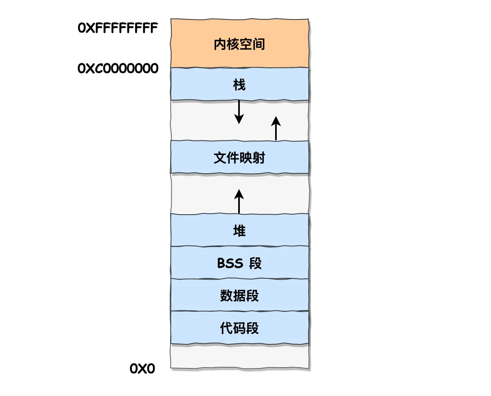
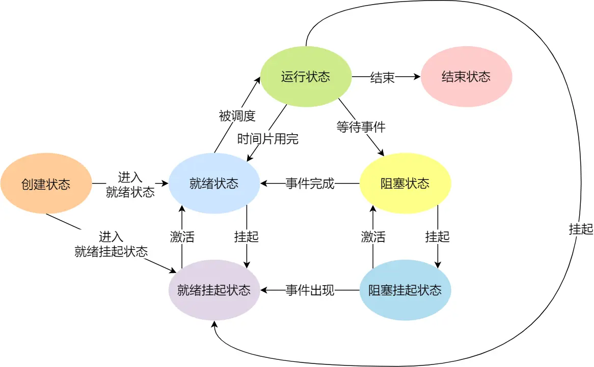
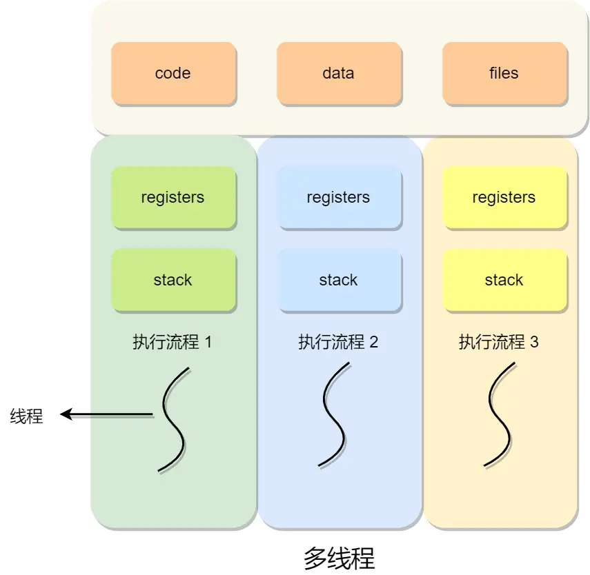

> https://xiaolincoding.com/os/

最近愈来愈觉得要在做中学，所以这里记录一下小林 coding 教程中
个人认为 OS 里面对非底层（i.e. 不涉及系统编程的）程序员的重要概念。
部分重要图解同样转载至上文，侵删。

注意这些内容是个人认为【绝对不能忘】的内容，而非一个完整的 list。
知道这些 high-level 的设计概念之后详细设计再进行深入。
类比一下，你可以把这些东西称作你应该放在 register 或者 L1 cache 里面的东西，
但是碰到细节问题你还是需要 L2, memory, disk 的。 : )

## CPU / Cache

1. 存储器的层次结构为：
   - Register
   - L1, L2, L3 Cache (SRAM)
   - Memory (DRAM)
   - Disk (SSD / HDD)
2. CPU Cache 每次访问数据（这个其实包括数据和指令）的时候都会缓存和其相邻的块。要充分利用这个 locality。
   - 访问数据时，按照内存的布局顺序访问。
   - 访问指令时，由于 CPU 存在分支预测，所以处理 collection 数据的 if-else 的时候，先 sort 再处理会更快。
     （原因是分支预测器在 collection 是顺序的时候会根据历史命中数据对未来进行预测，这样命中率会很高。）

## Memory

1. OS 为进程提供虚拟内存，并有一个 mapping 机制将虚拟内存 map 为物理内存。
2. 内存的分割分为**分段(segmentation)**和**分页(pagination)**。
   它们可以合在一起使用，称为**段页式内存管理**。
   i.e. 先把程序划分为多个有逻辑意义的段，再把每个段划分为多个页。
3. Linux 内存布局如下。
   
4. OS 会将没有经常用到的内存换出到物理内存之外，称之为 swap。
5. 对于`malloc`而言，分配虚拟内存时不会分配物理内存。只有访问的时候才会触发 page fault，分配物理内存。
6. 内存紧张/OOM 的时候内存存在一系列的[回收机制](https://xiaolincoding.com/os/3_memory/mem_reclaim.html#%E5%86%85%E5%AD%98%E5%88%86%E9%85%8D%E7%9A%84%E8%BF%87%E7%A8%8B%E6%98%AF%E6%80%8E%E6%A0%B7%E7%9A%84)。

## Process

1. 进程是一个运行中的程序。
2. 进程理论上有如下状态（Linux 的模型有所不同，但是基本思维类似）。
   
3. OS 通常会把阻塞的进程的物理内存 swap 到硬盘，需要的时候再换入。这个状态叫做**挂起**。
4. PCB（进程控制块）是进程的唯一存在标识，包括其状态，内存空间，打开的文件的列表，I/O，
   以及 CPU 的状态信息（用于进程被切换之后能继续执行）。
5. 进程间的通信方式有 pipe，消息队列，信号量(semaphore)，信号（唯一的异步通信机制），socket 等。

## Thread

1. 线程是进程中的一条执行流程，满足：（1）可以并发运行，（2）可以和同进程的线程共享相同地址空间。
   
2. 线程切换快的一些原因：无需创建 PCB，虚拟内存共享（意味着无需切换页表），
   数据传递无需经过内核（因为共享内存和文件资源）。

## Mutual exclusion and synchronization

1. 进程的协作可以通过锁和信号量实现。
2. 经典的几个问题：Dining philosopher, producer-consumer
3. 避免死锁最简单的方法就是**资源有序分配法**。（i.e. 两个线程用同样的顺序访问资源。）
4. 理解概念：互斥锁，自旋锁，读写锁，乐观锁，悲观锁。[详解](https://xiaolincoding.com/os/4_process/pessim_and_optimi_lock.html#%E4%BA%92%E6%96%A5%E9%94%81%E4%B8%8E%E8%87%AA%E6%97%8B%E9%94%81)

（未完待续）
