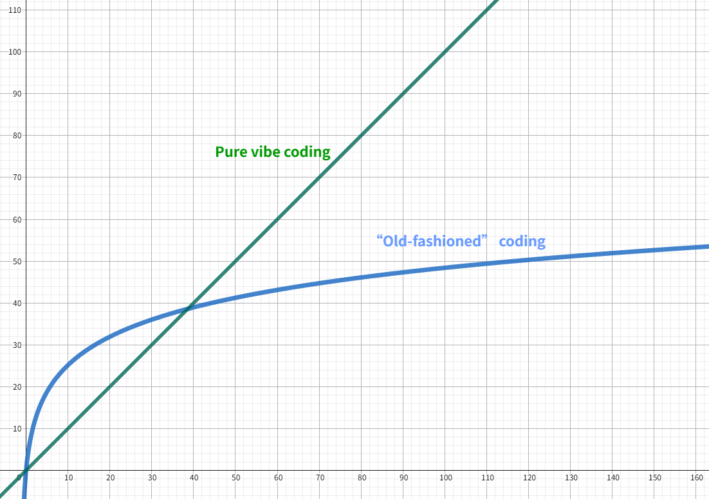

AI coding agents (in my context, LLM-based ones) are so popular these days that they became ubiquitous in many development environments.
I would hypothesize that one of the main reasons why people are so obsessed with it is how it boosts the efficiency of development. 
Indeed, it is hard not to imagine you are a super duper developer when you first see your agent streams out the code in no time and the code just works.

However, I was starting to notice some issues when reviewing the AI generated code myself. Rather than being confident in what I have done, I started to find that it seems I am looking the code through a thin layer of mist - where it **looks good to me (LGTM)**, but I am gradually feeling a sense of losing grasp of it. 

At the end, since it works and most projects I am now handling are not serious projects, I just merged it. But not knowing the implications behind each line and just let the agent code will almost definitely lead to unfixable chaos at the end.

It just urges me to ponder, to what extent did agents boost our efficiency?

## The long-term efficiency problem
There are already research like [this](https://arxiv.org/abs/2507.09089) which measures the impact of AI tools on the task completion efficiency of software engineers. But one important limitation of this kind of research is that it only measures the short-term efficiency boost for the engineers. That is, it only evaluates in the timespan of a certain task / task set, without evaluating the efficiency impact on the long-term which originates from the engineer's growth.

One (not-so-rigorous) analogy to understand this is to imagine:
1. a pure vibe coder who does not understand anything about the task, and
2. an "old-fashioned" coder which codes on his own and search / learn troubleshooting method along the way.

Suppose they execute $N$ tasks that is in the similar domain, and consider the function of **total time** they spent on those tasks. 

The vibe coder's time spent is somewhat $O(N)$ since he throws in a similar prompt and wait for the output, and let AI troubleshoot it. Hence, the vibe coder spents approximately a constant amount of time for each task.

On the other hand, the "old-fashioned" coder *could* behave like $O(logN)$ which struggles at first but then gradually learn the domain knowledge that supports him to spend less time, and save the troubleshooting time when the LLM just cannot reach the correct answer.

Of course, I am oversimplifying in this analogy. For example:
- There is an upper limit for human's code efficiency.
- There are chances that LLMs are so strong that, it ensures 100\% accuracy in some closed-form task and deep understanding is just not needed or obsolete. (AI: **"JUST TRUST ME :)"**)
- Agent systems also can grow as system maintainer gradually adds **harness** to it when encountering problems, making it less error prone and more efficient gradually.

With that said, I will be very interested if there are more research that looks into the long-term efficiency impact of AI coding agents, since the process of programming definitely happens at a longer time scale, both for individuals and companies.

## Hidden prerequisite of harness engineering
> **_"One cannot ask questions beyond one’s own cognition."_**

Speaking of harness, I do think it is a great engineering approach to deal with chaotic systems like LLMs (which I think it is), especially the rule-based parts.
You confine the system's state in a "nice" subspace of the whole vector space by adding constraints such as providing feedback via hard-coded testcases.

_I do recommend the [original blog that brings forward harness engineering](https://mitchellh.com/writing/my-ai-adoption-journey) by Mitchell Hashimoto who co-founded HashiCorp and created Terraform._

Despite the popularity of harness engineering, one hidden yet somehow critical prerequisite for writing a harness is that you at least shall have a higher level of understanding comparing to the AI agent. After all, if you do not know the internal details of the system, the implicit domain knowledge and best practice, how can you turn those constraints into rules?

Unfortunately, those knowledge that are used to control the LLMs cannot be easily acquired.
- System specific knowledge are somehow more confined in the private domain
- Engineering tradeoffs are case-by-case
- Best practices and instincts are hard to learn from textbooks and more learnt by hands-on that involves error and retrospectives.

I once read the [post (in Chinese)](https://www.zhihu.com/question/2018018595418980371/answer/2027039762708541878) from Prof. Tuo Zhao about his thought in AI agents and teaching students, where I quote the translation here:

> _"What I learned through this process went far beyond writing C++ or tuning BLAS routines. It was only by building software for a real system — one with actual users, real performance constraints, and production-level demands — that I gradually came to understand what numerical stability really means, what good interface design looks like, and what it takes to make trade-offs under engineering constraints."_

> _"Students would come to me with these problems, I would explain the reasoning behind them, and then they would go back and revise their code — only to run into new problems afterward. On the surface, the cycle looked slow. But in reality, it was an incredibly efficient training mechanism. By being forced to implement things themselves, students were also being pushed into thinking at the design level. What they learned wasn’t just how to write code, but how to understand a complex system."_

> _"The reason I’m comfortable letting AI rewrite large portions of code is because I already know how to verify the results. … There are countless implementation details you simply cannot learn from reading a textbook. They’re forms of judgment that accumulate slowly through debugging, through mistakes, through running into problems over and over again. … What people lack today is not the ability to write code, but the ability to judge whether code is actually correct. And that kind of judgment can only be built by having implemented things yourself. This creates a paradox that I find deeply unsettling: AI has made implementation easy, yet implementation experience is precisely what builds the ability to verify. Verification ability is a prerequisite for using AI effectively, but the very path that develops that ability is now being eroded by AI itself."_

In another sense, although LLM coding agents seem powerful, because of its chaotic nature (e.g. hallucination), its capibility is somehow **soft-capped** by its user's capability in the context of coding. Missing hands-on and retrospective, in that sense, dangerously lowers this cap.

## Do we really yield "profit" from agents?
A very simple and trivial rule in finance is that if the return is negative, you should NOT invest in it.
We can easily migrate this reason how we shall use our AI.
The **revenue** from using AI agent is somehow $T_{handcoding} - T_{prompt}$, while the **cost** is the difference in, say $T_{review}$, $T_{housekeeping}$ or $T_{harness\ engineering}$ (or maybe plus the bill you paid for your tokens which could skyrocket).

To be clear, **I am NOT an anti-AI activist**. 
I did research on deep learning and I utilize LLMs in many explorations, learning, brainstorming and summarization tasks,
and they do bring about convenience.

But still, I do encourage every software engineers to think about how to use LLMs to make the `revenue - cost` positive. 

- Is it okay to not understand the system so deep? Is there a chance that I pay for the cognitive debt in the future?
- Do extra fact-checking and review time exceed the merit of code generation speed?
- Is writing "detailed" natural language specifications and harness really faster than writing code? After all the most unambiguous specification is code.

Again, those questions should be considered case-by-case in different scenarios, and the answer changes on the nature of the project or the scale of impact.

I would like to share some circumstances where I do get sure profit from LLM technologies.
- **Navigation**: I let AI guide me through the codebase to provide some understanding. It helps me shrink the search space a lot, and I can easily identify if the AI is hallucinating when I inspect the code.
- **Brainstorming**: A good nature of chaotic system is that it can diverge which could lead you to considerations you never thought before. Although many of them are easily searchable on the Internet, it is good to talk with it like talking with a junior in a different field where you can keep in mind that it could be wrong. 

## Ending
When I was attending my undergraduate lab, my supervisor first told me that "engineering is all about tradeoffs". 
And it is not in any sense different when we are introducing AI agents into our workflows.
The simplest modelling for the tradeoff is **coding efficiency** and **growth efficiency**, but even so caveats exist. AI is here to stay, and a careful retrospective on this, in my opinion, is important in this new development paradigm.